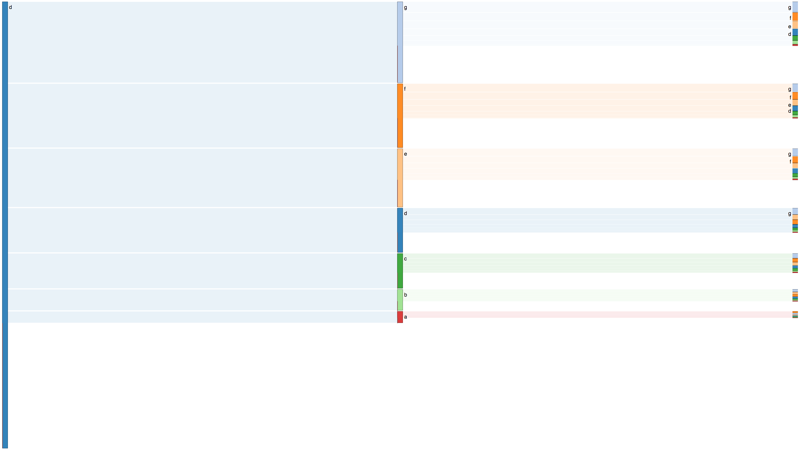

<!-- README.md is generated from README.Rmd. Please edit that file -->


# shiny.alluvial

Visualizes workflows from sessionized, timestamped data using an alluvial diagram.
The resulting web page is interactive. Clicking on a node re-anchors the vis to show workflows outward from events with that node label.



## Installation

You can install shiny.alluvial from github with:


```r
# install.packages("devtools")
devtools::install_github("claytonstanley/shiny.alluvial")
```

## Example

Visualize the workflows that are in the provided sessionTbl dataset:


```r
runAppSK(sessionTbl)
```

